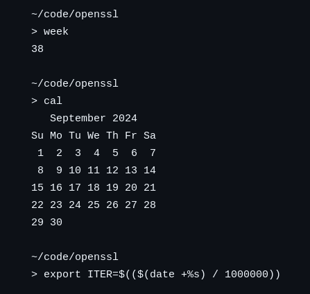

# Employee of the Week

### Challenge Overview
This was a easy and fun challenge to get to do some scripting early on in the competition on my part.
It is a challenge that is solved when finding the needle in a heystack, which fortunatly is easy with compuers.

**Challenge extract:**
> "Our 'employee of the week' eloped. He was the only one that knew the master class secret. We managed to extract logs from his last activities. Can you find anything from this?"

This "last activity" log contained some crucial details:
- The encryption command, using **AES** via OpenSSL to encrypt `master.txt` which we must assume is the flag with an **iteration count (ITER)** and a password `$PWD`.

**Log excerpt:**
```bash
> openssl enc -aes-256-cbc -pbkdf2 -iter $ITER -in master.txt -k $PWD -a
U2FsdGVkX1+/39qrCQ9rlxMW2E30ylTUXYS+GTAVDMUK0oXJvkUDBCRbhClK2GKYc50OQZ7zgLPBhkMW8CM5VVnZBrxfyH5CAG8nj5BPDCg=
```
I saved this output to a file such that we could script over it later on.

Then I created what I imagined would be the correct command to decrypt this later on.
```bash
openssl enc -d -aes-256-cbc -pbkdf2 -iter ($(iter_value)) -in enc.enc -k ($(PWD)) -a
```
Here we are missing two peices of information. `iter_value` and `$PWD`.

- The `ITER` was generated from a UNIX timestamp, calculated by dividing by one million.
```bash
export ITER=$(($(date +%s) / 1000000))
```
It would be crazy to search all seconds throughout all time, but thankfully the log shows the admin using the `week` and `cal` commands which both show the week number and the year. 

This is doable to find.

That leaves us with just `$PWD`, normally this is the current working directoy of a shell, but investigating the shell log further showed this.
```bash
export PWD=$(hostname)
```


- The password was derived from the hostname (`ubuntu-s-1vcpu-512mb-10gb-ams3-01`).

This leaves us with 
```bash
openssl enc -d -aes-256-cbc -pbkdf2 -iter ($(iter_value)) -in enc.enc -k "ubuntu-s-1vcpu-512mb-10gb-ams3-01" -a
```

### Finding the solution
Now we just needed to find the needle (the correct second) in the heystack (week 38 of 2024).

I was looking forwards to coding this, but I also wanted to finish quickly to be able to move on to other challenges, so I used the friendly chat-bot (I'm sorry).

Chatbot output:
```plaintext
1. **Generate timestamps** for each second in week 38.
2. **Calculate `ITER`** by dividing each timestamp by 1,000,000.
3. **Test each possible `ITER`** to decrypt the encoded file, hoping to land on the one used in encryption.

Using Python, I scripted a loop to automatically generate timestamps for the week and attempt decryption for each one. Here’s a closer look at the script:
```
```python
import os
import subprocess
import datetime

# Define week 38 in September 2024
start_date = datetime.datetime(2024, 9, 15)
week_start = start_date
week_end = week_start + datetime.timedelta(days=7)

# Generate timestamps within that week
timestamps = []
current_date = week_start
while current_date < week_end:
    timestamps.append(int(current_date.timestamp()))
    current_date += datetime.timedelta(seconds=1)

# Iterate over possible ITER values
for timestamp in timestamps:
    iter_value = timestamp // 1000000  # Calculate ITER from timestamp
    env = os.environ.copy()
    env['ITER'] = str(iter_value)

    command = [
        "openssl", "enc", "-d", "-aes-256-cbc", "-pbkdf2",
        "-iter", str(iter_value), "-in", "enc.enc", "-k", "ubuntu-s-1vcpu-512mb-10gb-ams3-01", "-a"
    ]

    try:
        output = subprocess.check_output(command, env=env, stderr=subprocess.DEVNULL)
        print(f"Success with ITER = {iter_value}")
        print("Decrypted content:", output.decode('utf-8'))
        break  # Stop if decryption succeeds
    except subprocess.CalledProcessError:
        continue
```

When the friendly chat-bot knows gets enough information it often manages to write functionall code.
I'm not really sure if this is a good code or not, but it worked and I havent looked back at it since. I guess I could have tried to style it nicely for the writeup, but I didnt bother. (im sorry)
```plaintext
Success with ITER = 1726
Decrypted content: Master class secret: EPT{Ach13v3m3nt_Unl0ck3d_293857}
```


